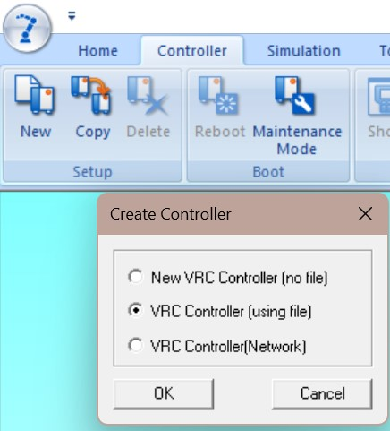

# MOTOSIM Instructions

Yaskawa Motosim Simulation Environment

## License Setup
* Individual
Simply plugin the USB key into the Motosim computer

* Educational Network License
Plug the USB license key to server, and make sure the Motosim computer is on the same network as license server (make sure to ping).
On Motosim computer, navigate to <http://localhost:1947/_int_/ACC_help_index.html> and go to {Configuration} -> {Access to Remote License Managers}
Enable {Allow Access to Remote Licenses}.
Enable {Aggressive Search for Remote Licenses}.
Enter the IP address or hostname into the {Remote License Search Parameters} box (RPI license server IP is `128.113.26.60`).
Click ‘Submit’.

## Setup
### From Backup File
On a physical controller, go to {MAIN MENU} -> {EX. MEMORY} and create a {SYSTEM BACKUP(CMOS.BIN)} file to the USB drive. Copy it over to the Motosim computer.

Open Motosim, create a new cell and go to {Controller} -> {New} -> VRC Controller (using file) and select the CMOS.bin backup from created before.

### From a Virtual Cell
Motosim cell environment is self-contained, and its default direction is `C:\Users\Public\Documents\MOTOMAN\MotoSimEG-VRC\Cells`. Simply zip/unzip the cell directory here should work.

## CAD Tree
CAD models are managed under {Home} -> {CadTree}.
* Model Insersion: Click {Add} at the upper left corner.
* Position: Right click your model, {Set Position}.
* Scale: Right click your mode, {Property}.
* Export CAD: Right click on your model under {Cad Tree} -> {Export CAD File}.

## Program
### Load Program 
Just like a physical controller, a virtual controller has its own memory unaccessible. In order to load an INFORM program, you need to drop the program into `<YOUR_CELL_DIRECTORY>/<CONTROLLER_NAME>/Storage Card/`. Treat it like the USB driver on a physical controller, and you can load the program as {MAIN MENU} -> {EX. MEMORY} -> {LOAD}.

### Run Program
On the virtual teachpendant, under Play Mode, and click {START}.

### Delete Program
Just like a physical controller, {JOB} -> {SELECT JOB} -> {JOB} -> {DELETE JOB}.

## Tips
* Teachpendant Display: {Controller} -> {Show}.
* Teachpendant Buttons: upper right corner of the display.
* Joint Pulse Recording: {Simulation} -> {Pulse Record}.

