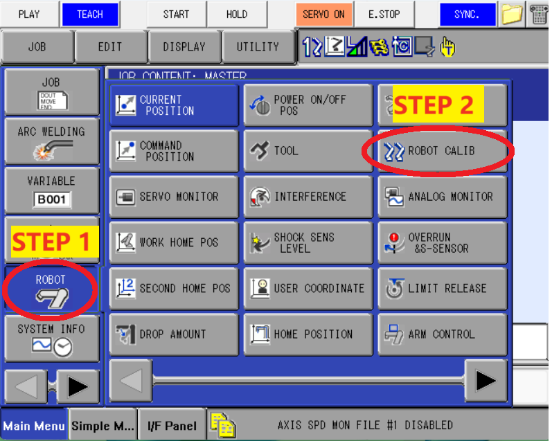
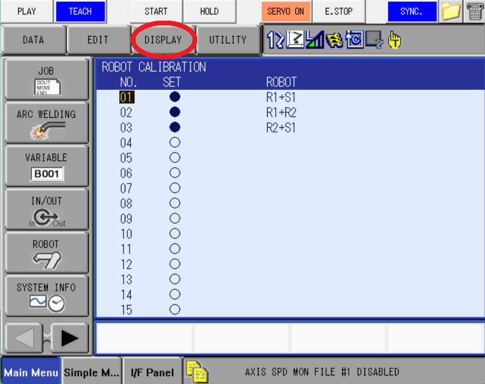
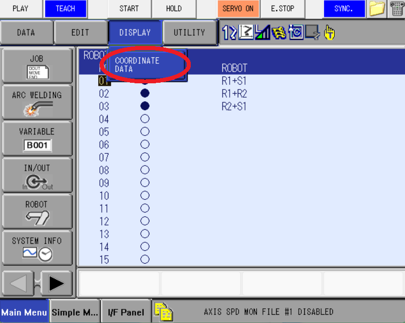
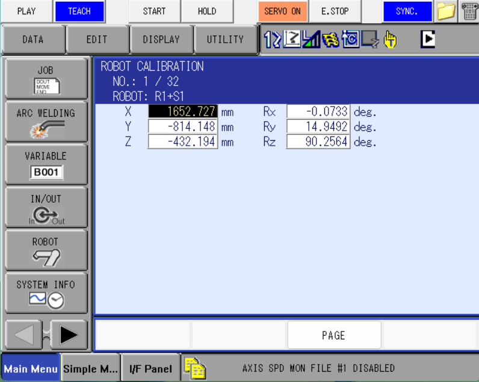
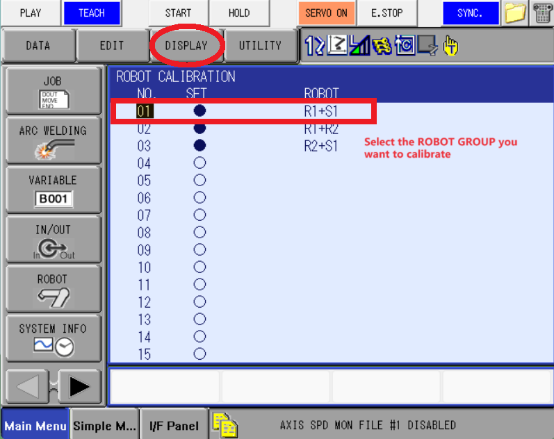
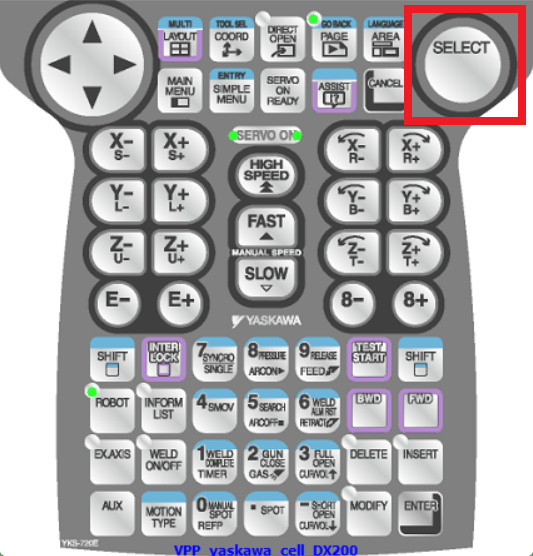
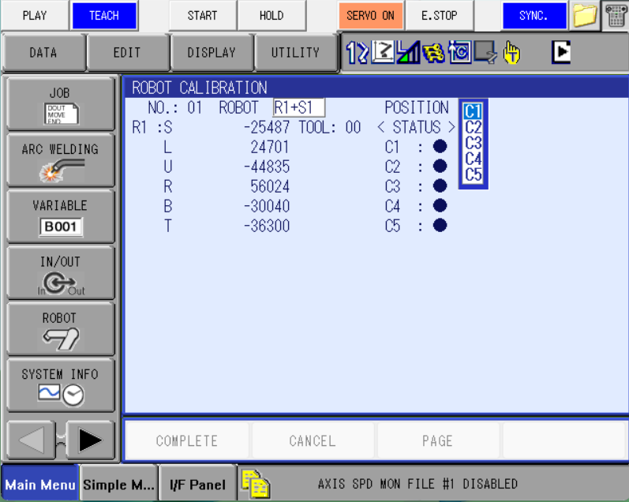
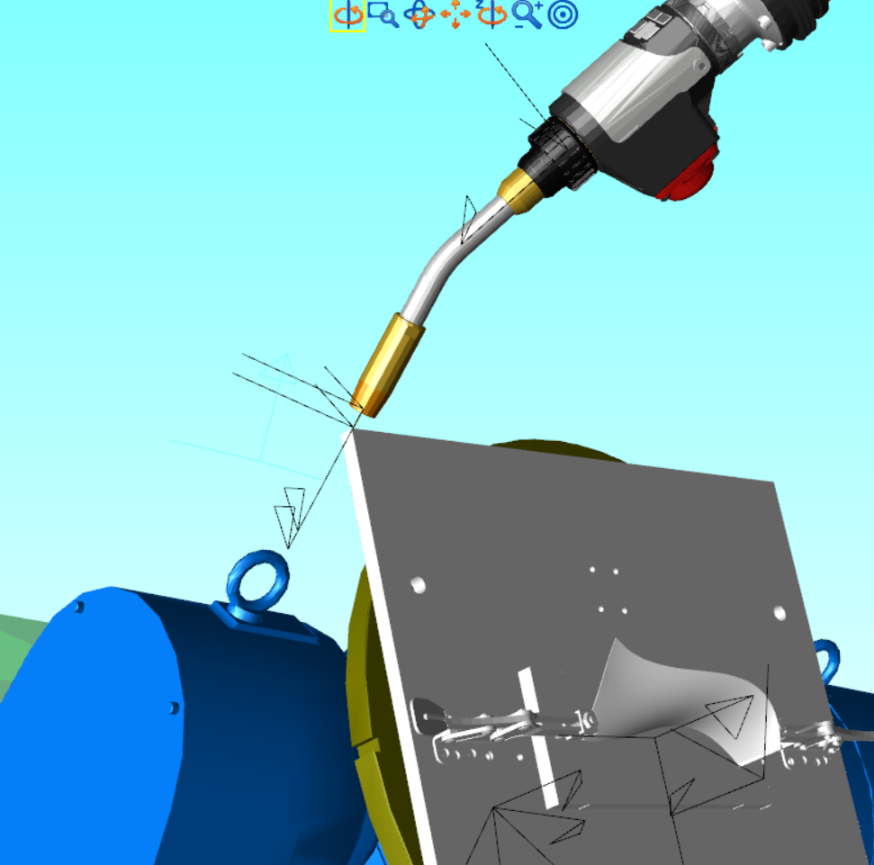
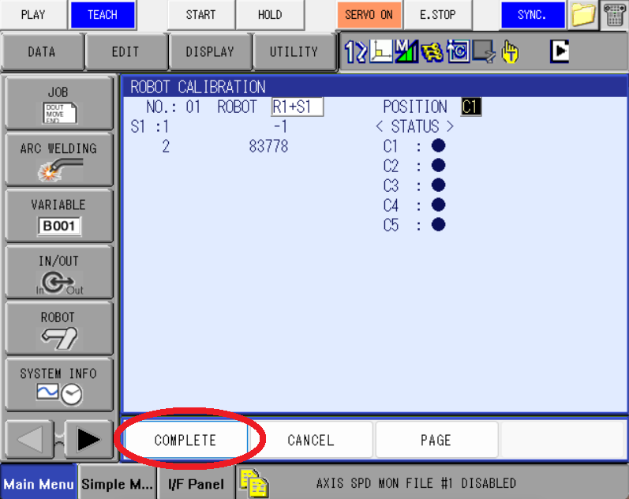

# MOTOMAN DX200 Motion Primitive Control

Controls DX200 with FTP Ethernet functions

## Settings
* Maintaince Mode: Press {MAIN MENU} and boot
* Set IP: (Maintaince Mode) -> HOST SETUP -> IP ADDRESS -> `192.168.1.31`
* Management Mode: {MAIN MENU} -> {SECURITY} -> {MANAGEMENT MODE}, password is 999999999
* Safety Mode: {MAIN MENU} -> {SECURITY} -> {SAFETY MODE}, password is 555555555
* Command Remote: {MAIN MENU} -> {IN/OUT} -> {PSEUDO INPUT SIGNAL} -> *CMD REMOTE SEL*, press [INTERLOCK]+[SELECT]
* Enable FTP: {Main Menu} -> {EX.MEMORY} (Username is `ftp` and arbitrary password, use the IP set above.)
* PC IP: Change computer's IP to manual, under the same subnet as DX200's IP
* Pulse to Deg: {Main Menu} -> {SETUP} -> {FUNCTION ENABLE}. Set ALL AXES ANGLE DISP Function to VALID. {ROBOT} -> {CURRENT POSTION}: 
Toggle DISPLAY to Pulse/Absolute Degrees
* Tool Calibration/Data: Under Safety Mode,  {Main Menu} -> {ROBOT} -> {TOOL} -> {Utility} -> {Calibration}/{W.GRAV.POS.MEASURE}
* Base Pose Calibration: {Main Menu} -> {ROBOT CALIB} -> top bar {DISPLAY} -> {COORDINATE DATA}

## Useful Tips
* Wire Feed/Retract: Under Teach Mode, Number 9 and Number 6.
* Digital Output:  {Main Menu} -> {IN/OUT} -> {Universal Out}, use [Page] (or [Shift]+[Page]) button to switch pages, use [INTERLOCK]+[SELECT] to toggle the output
* Robot Control: Shift+Robot to switch between robots; Coord to change among (joint space, Base frame, tool frame)
* Job Save/Load: Jobs created on teachpendant need to be saved to EX.MEMORY (USB drive on the back) manually. Same for loading
* Pulse2Deg: Absolute Angle and Pulse have sign flip for some joints, USE PULSE sign as reference.
* Alarm Release for Manual Jogging: {OVERRUN&SHOCK SENSOR} and {LIMIT RELEASE}
* Digital I/O Board: CN306 ~ CN309, refer to diagram in the cabinet
* Functional Safety Reset: Boot into Maintance Mode, under Safety Mode {FILE} -> {INITIALIZE} -> {Functional Board Safety Reset} 
* I/F Panel: Monitor welding parameters (current/voltage, etc.)
* Register: M368, M362 and M363 for welding parameters
* Units: {Main Menu} -> {SETUP  } -> {OPERATE COND.}
* Positioner J2 limit release: {Main Menu} -> {ROBOT} -> {SOFTLIMIT SETTING}, D500B J2 can set to +/-1e9-1 pulses

## MotoPlus Setting
Motoplus program will run at background after boot up, and it's a `.out` file compiled in VS. Boot into Maintenance Mode and load .out file to USB drive. Motoplus could be connected with VGA display, see manual.
* MotoPlus APL.: LOAD(USER APPLICATION)

## Welder Setting
Set IP and Gateway of Fronius Welder to communicate with DX200
* Fronius IP: Deselect DHCP, IP Address: `192.168.1.55`, Standard Gateway: `192.168.1.31`
* DX200 (Management): Weldcom Options -> ARC DIGITAL I/F FUNC. -> Power Source IP Address: `192.168.1.51`, HTTP POWER SOURCE IP ADDRESS: `192.168.1.55`
* External Control: Defaults -> Interface -> external (to make DX200 have control over jobs)
* DX200 (Parameters): AIP107=1 (Fronius control, 0 for robot control, leave it at 0)

Welder Interface could be accessed through browser at its IP.

## Usage
Connect Ethernet from DX200 to computer, and make sure you can ping DX200 from your computer. 
`python dx200_motion_program_exec_client.py`, the program will generate `.JBI` file, send to DX200 and execute.

Install the package by `python setup.py install`.

## Motosim
Refer to [Motosim Manual](Motosim.md).

## Robot Calibration (On Teach Pandant)
### Check robot calibration data from teach pandant
* Click [ROBOT] on left menu, and select [ROBOT CALIB]

* Click [DISPLAY] and select [COORDINATE DATA]

* The data shown on the screen will be robot calibrated configuration:

### Robot calibration
* Use [select] on teach pandant and select the robot group to calibrate:

* Use `5 points rule` for calibration:
Point the TCP of robot#1 to a reference point on robot#2, and keep them pointing each other for all 5 points:

Jog C1, C2, C3 with fixing 2nd axis of robot#2.
Jog C3, C4, C5 with fixing 1st axis of robot#2.
Use [MODIFY] + [ENTER] to adjust C1 - C5.

Click [COMPLETE] to finish robot calibration, if errors happen, follow the error instruction to re-adjust C1 - C5.

