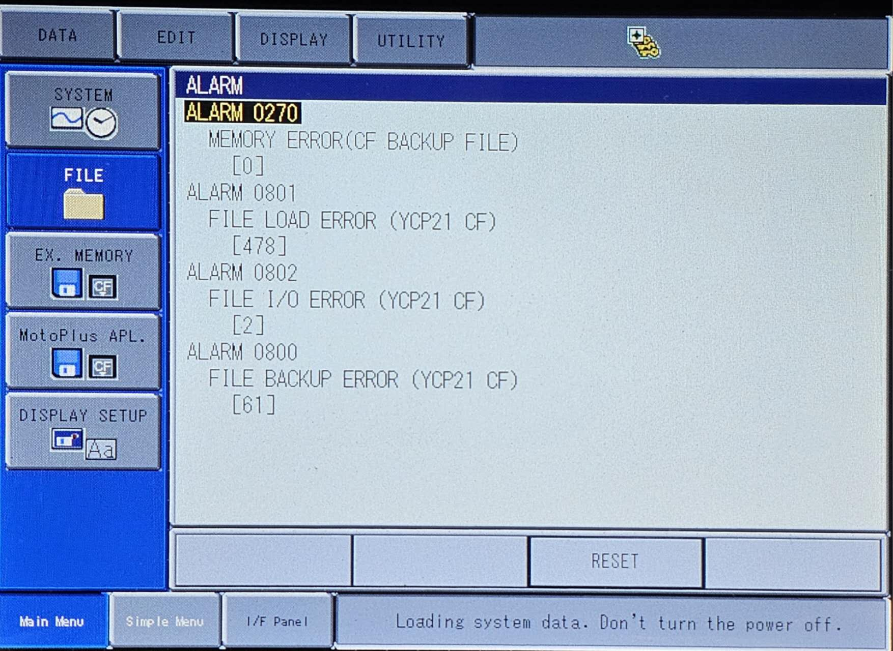
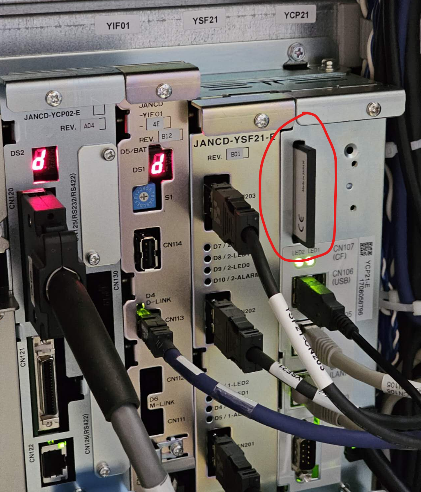
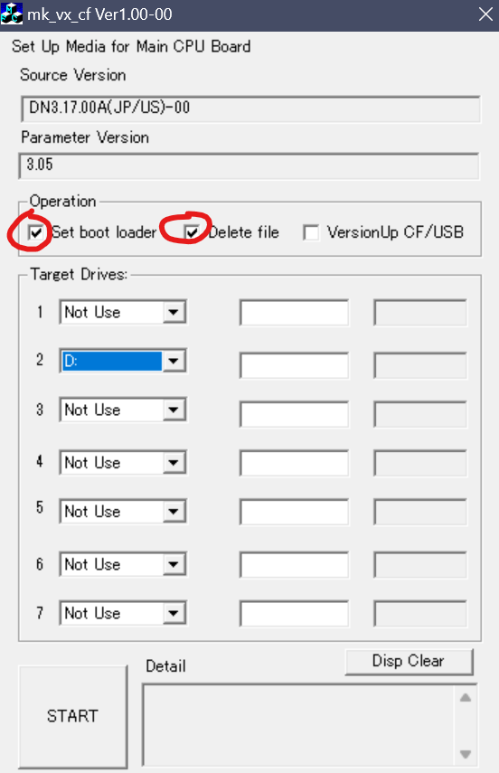
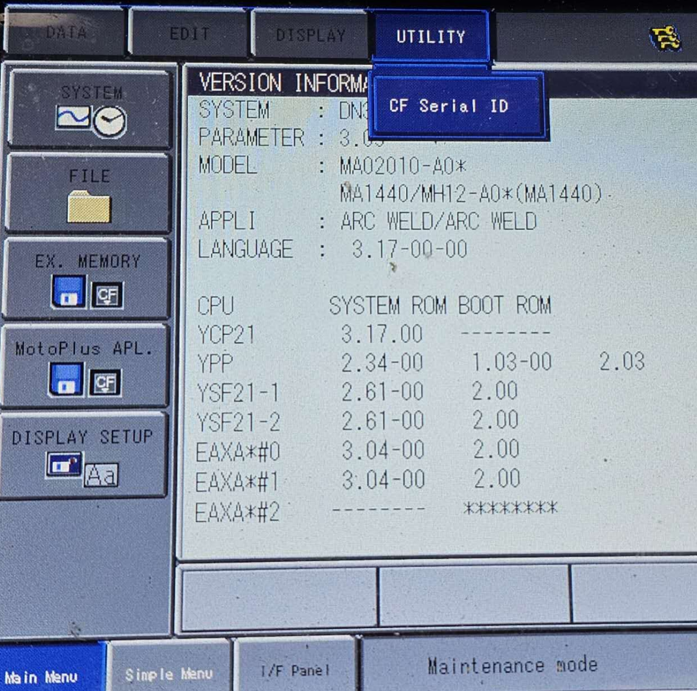

# YCP21 Compact Flash Setup

Plug in the VGA cable with a display for debugging.

The main computer (YCP21) has its system on CF card as shown below. 

# Image Setup
Our WAAM cell uses Software Version DN3.17.00A(US)-00, and this info can be found under `SYSTEM.SYS` file. RPI box includes the image flash tool from Yaskawa, and `vcredist_x86.exe` is required to be installed and included in the folder. `mk_vx_cf.exe` is the tool to burn the CF card, need to check `Set bootloader` and `delete files` as shown below.

# Load Backup to CF Image
DX200 only recognizes the CF card it has always been using. Swapping CF card from other controllers or a brand new burnt CF card will result in **Total Checksum Error** due to different configurations. In order to load backup file `CMOS.bin` onto the CF card, the controller needs to be in **One Time Management Mode**, which requires a password depending on the system and CF card serial ID. 

CF card serial ID could be looked up under {System} -> {Version} -> {Utility} -> {CF Serial ID}. Copy this and zip `CMOS.bin` and send to `techsupport@motoman.com` to acquire the one time passcode. 

Once in the **One Time Management Mode**, make sure the `CMOS.bin` is included in the teachpendant USB. Load the backup by {Ex. Memory} -> {LOAD} ->{CMOS}. Loading process takes 2~5 minutes, and perform a `Functional Safety Board Reset` under {Initialize} after the flashing finished.

## Compatability